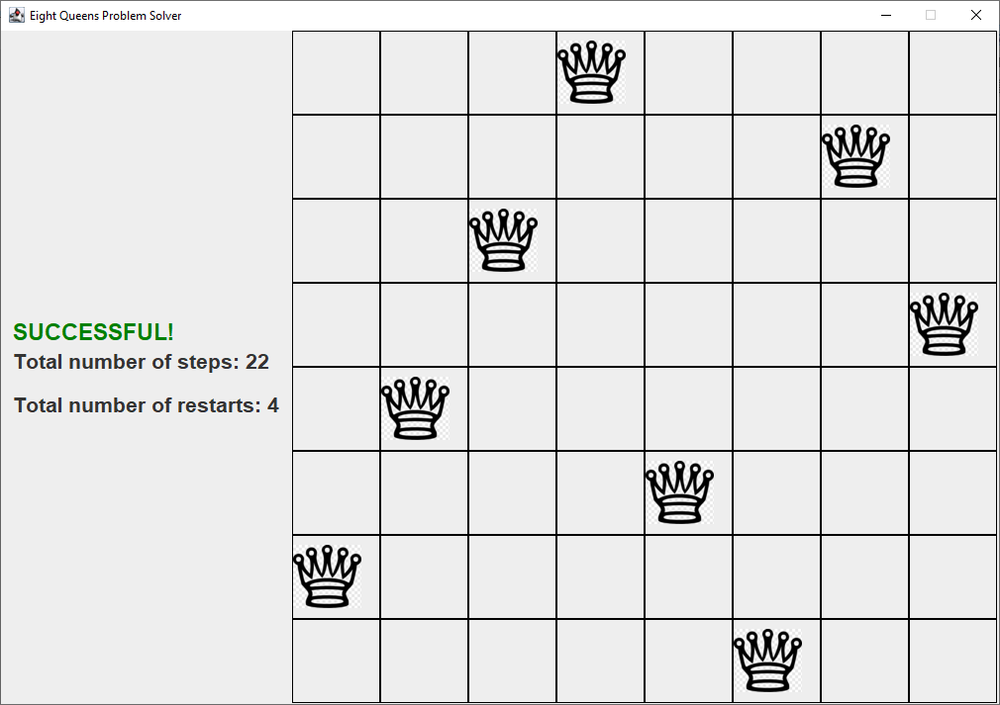

# Inspiration

This is a Eight Queen Puzzle Solver Simulation which was developed by using Java.

## Eight Queen Puzzle

The Eight Queen Puzzle is a problem of placing eight queens on a chessboard.

## Solution

This problem was solved by using Hill Climbing Algorithm which is a searching algorithm. If we sure about that the problem has a solution, the Hill Climbing Algorithm guarantees to find a solution.

## Program Flow

1. The chessboard was represented with using 8x8 two-dimensional array. So, when the program was started, it generates randomly placed queens on the board.
 1. It puts a queen for each column.
1. When the chessboard was created, the program calculates the cost of the current state and stores it.
1. After the calculation, it generates the all state possibilities from this state and calculates the cost of each state.
 1. We know that the chessboard is an 8x8 two-dimensional array and there is only one queen for each column. So, there will be 64 possibilities for each state.
1. Then replaces queens with the lowest cost state. 
1. It does these steps until find the zero cost state.

## Local Extremum Problem

There is a common problem that programmers face with while using Hill Climbing Algorithm. The problem is getting stuck at local extremum points. If we want to achive successful state, we must prevent this stucking problem. But first, we must understand the problem. Consider the scenario is given below.
* The current state has 23 unit costs.
* Program generates all possibilities from this state and calculates the cost of each one.
* Problem occurs at this point. Program cannot find low cost state.
* Program acts like that it found the lowest cost state it can found.
* But the real solution is zero cost.

### How to prevent the local extremum problem?

The simplest solution is replacing queens again.

## Conclusion

If the problem has a solution and if we prevent the local extremum problem, this algorithm guarantees to find a solution no matter how costly. 